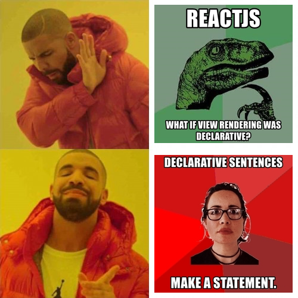

# ⚛️ react-declarative-lite

> The `lite` verion of the [react-declarative](https://github.com/react-declarative/react-declarative)

[](https://npmjs.org/package/react-declarative-lite)



This is a lighter version of [react-declarative](https://www.npmjs.com/package/react-declarative) which exports the `<One />` component and dependencies only and as such makes the library slightly faster and smaller. Unlike `react-declarative`, it doesn't provide any additional overhead like state management. For a note, that library should be used when you want to use `<One />` forms in existing app

## Contribute

> [!IMPORTANT]
> Made by using [react-declarative](https://github.com/react-declarative/react-declarative) to solve your problems. **⭐Star** and **💻Fork** It on github will be appreciated

## Usage

```bash
npm install react-declarative-lite
```

## Example

```
import { One, TypedField, FieldType, getInvalidFields } from "react-declarative-lite";

export const fields: TypedField[] = [
    {
        type: FieldType.Outline,
        fields: [
            {
                type: FieldType.Typography,
                typoVariant: 'h6',
                placeholder: 'Example form',
            },
            {
                type: FieldType.Text,
                validation: {
                    required: true,
                    numeric: true,
                    minNum: 5
                },
                name: 'first_field',
            },
            {
                type: FieldType.Text,
                validation: {
                    required: true,
                },
                name: 'second_field',
            },
            {
                type: FieldType.Text,
                validation: {
                    required: true,
                },
                name: 'third_field',
            },
            {
                type: FieldType.Button,
                sx: {
                    mt: 3
                },
                buttonVariant: 'contained',
                title: 'Submit',
                click: (name, e, data, payload) => {
                    const errors = getInvalidFields(fields, data, payload);
                    if (errors) {
                        const [error] = errors;
                        notify(`${error.title}: ${error.error}`);
                    } else {
                        notify("The form is valid");
                    }
                },
            }
        ]
    }
];

...

<One
    fields={fields}
/>

```
